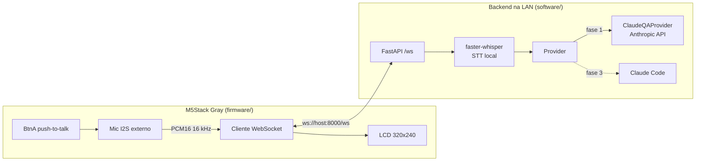
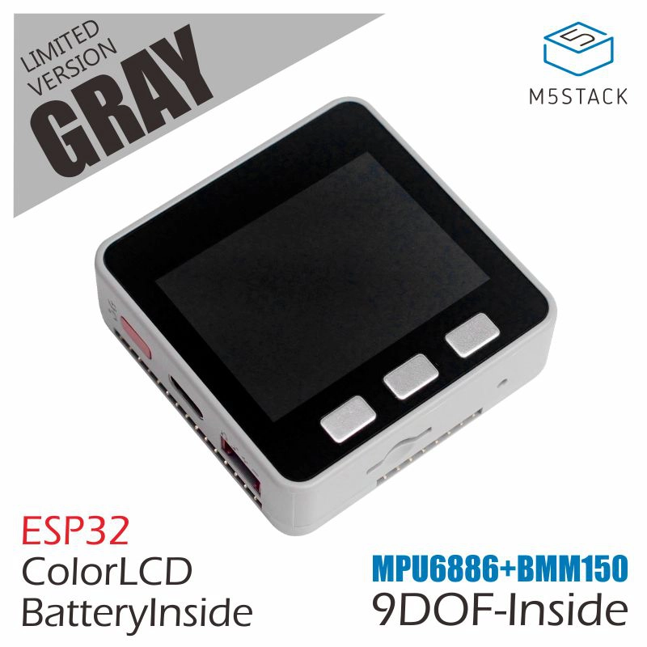

# IAPet

Assistente de voz de mesa baseado no **M5Stack Gray** (ESP32) conectado à
Claude. O usuário segura um botão, faz uma pergunta em voz alta e a resposta
aparece na tela. Em repouso, o dispositivo mostra o caranguejo da Claude.

O processamento pesado (transcrição e modelo) fica num backend na rede local;
o dispositivo só captura áudio, transmite e exibe. O backend é organizado em
*providers*, de modo que trocar "responde perguntas" (Claude API) por "executa
comandos" (Claude Code) seja uma troca de configuração, sem mudar o firmware
nem o protocolo.

> **Status:** em desenvolvimento inicial. Firmware com estrutura base e
> configuração limpa (compila); lógica de UI/áudio/WebSocket e backend ainda
> não implementados. Plano completo em
> [`docs/greedy-discovering-iverson.md`](docs/greedy-discovering-iverson.md).

## Arquitetura



Fluxo de uma pergunta:

1. Segurar **BtnA** → device envia `{"type":"start"}` e transmite o áudio do
   mic em frames binários (512 amostras PCM16, 16 kHz) — tela "Ouvindo...".
2. Soltar o botão → `{"type":"end"}` — tela "Pensando...".
3. Backend transcreve localmente (faster-whisper), passa o texto ao provider
   ativo e responde `{"type":"answer","text":"..."}`.
4. Device mostra a resposta (rolagem com BtnB/BtnC) e volta ao caranguejo
   após nova pressão de BtnA ou ~20 s.
5. Falhas retornam `{"type":"error","message":"..."}`, exibido por alguns
   segundos.

## Hardware



**M5Stack Gray (K002)** — referência oficial:
<https://docs.m5stack.com/en/core/Gray>. Extração detalhada (pinagem
completa, M-Bus, endereços I2C, restrições de GPIO) em
[`docs/hardware-m5stack-gray.md`](docs/hardware-m5stack-gray.md).

| Item | Especificação |
|---|---|
| SoC | ESP32-D0WDQ6, dual-core LX6 @ 240 MHz |
| Memória | 520 KB SRAM, 16 MB flash, **sem PSRAM** |
| Display | 2" IPS 320×240, ILI9342C |
| Botões | 3 físicos — A/B/C em G39/G38/G37 |
| Áudio | speaker 1 W no DAC 8 bits (G25), **sem microfone** |
| Sensores | MPU6886 (0x68) + BMM150 (0x10) — 9 DOF |
| Energia | IP5306 (I2C 0x75), bateria 110 mAh, USB-C 5 V |
| Expansão | Grove A (I2C G21/G22), M-Bus 30 pinos, microSD |

Consequências para o projeto:

- **Microfone externo obrigatório**: mic MEMS I2S (ex.: INMP441) no M-Bus —
  BCK G12, WS G13, DATA G34 — em `I2S_NUM_1` (o `I2S_NUM_0` é do DAC do
  speaker). Módulo ainda a definir.
- **Sem PSRAM** (~320 KB de heap): áudio em streaming sem buffer de gravação,
  imagens em flash (PROGMEM), sem sprite de tela cheia, WebSocket sem TLS na
  LAN.

## Estrutura do repositório

```
IAPet/
├── CLAUDE.md                  # diretivas para o Claude Code neste projeto
├── README.md
├── docs/
│   ├── greedy-discovering-iverson.md   # plano de arquitetura e fases
│   └── hardware-m5stack-gray.md        # referência de hardware
├── media/                     # imagens da documentação
├── firmware/M5_IAPet/         # firmware PlatformIO (Arduino)
│   ├── platformio.ini         # env m5stack-gray
│   └── src/
│       ├── main.cpp
│       ├── config.h           # includes e defines do projeto
│       ├── secrets.h          # credenciais locais (gitignored)
│       └── secrets.h.example  # template de credenciais
└── software/                  # backend Python (a implementar)
```

## Firmware

Requisitos: [PlatformIO](https://platformio.org/) (CLI ou extensão do VS Code).

```bash
cd firmware/M5_IAPet
cp src/secrets.h.example src/secrets.h   # preencher WiFi e endereço do backend
pio run                                  # compilar
pio run -t upload                        # gravar
pio device monitor                       # log serial (115200)
```

Configuração do PlatformIO: `board = m5stack-core-esp32-16M` com
`board_build.partitions = default_16MB.csv` (usa os 16 MB de flash; a tabela
padrão da board é de 4 MB). Dependências: M5Unified, links2004/WebSockets,
ArduinoJson.

`src/secrets.h` define `WIFI_SSID`, `WIFI_PASSWORD`, `BACKEND_HOST`,
`BACKEND_PORT` e `BACKEND_PATH`. Sem ele, a compilação para com `#error`.

## Backend

*A implementar em `software/`.* Planejado:

- FastAPI + uvicorn, endpoint WebSocket `/ws`.
- STT local com `faster-whisper` (modelo carregado uma vez no startup).
- Interface `Provider.answer(text) -> str`; provider ativo escolhido via
  `.env` (`PROVIDER=claude_qa`).
- `.env`: `ANTHROPIC_API_KEY`, `ANTHROPIC_MODEL`, `WHISPER_MODEL`,
  `PROVIDER`, `HOST`, `PORT`.

```bash
cd software
python -m venv .venv && source .venv/bin/activate
pip install -r requirements.txt
cp .env.example .env   # preencher
uvicorn app.main:app --host 0.0.0.0 --port 8000
```

## Roadmap

| Fase | Escopo |
|---|---|
| 1 | Q&A por voz: mic → STT local → Claude API → texto na tela |
| 2 | TTS: backend devolve áudio pelo mesmo WebSocket, tocado no speaker |
| 3 | Provider Claude Code: executar comandos de verdade no host |

Itens em aberto: escolha do módulo de microfone, imagem do caranguejo para o
idle, chave da API da Claude e máquina que hospedará o backend.

## Convenções

- Commits no padrão [Conventional Commits](https://www.conventionalcommits.org/)
  (`feat(audio): ...`, `fix(ws): ...`).
- Toda função documentada em Doxygen: `@brief`, `@param` de cada entrada e
  `@return`.
- Credenciais nunca versionadas: `secrets.h` / `.env` locais, com `.example`
  versionado.
